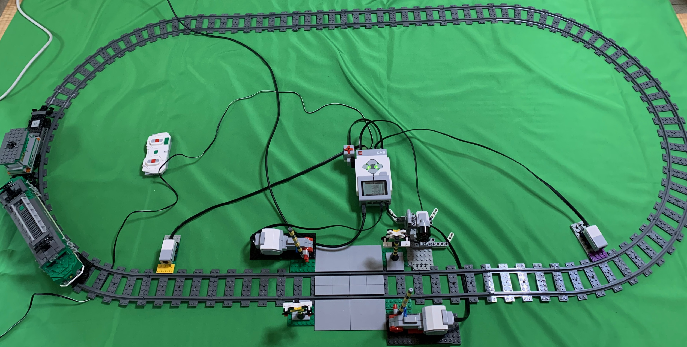
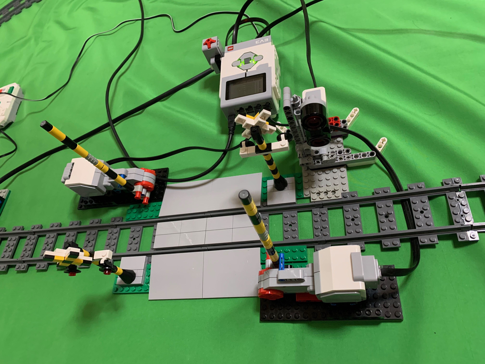
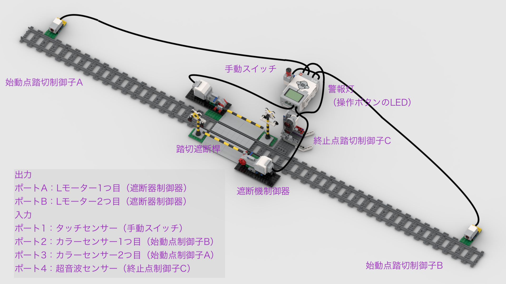

[English](README.adoc) | [日本語](README_ja.adoc)

= STAMP/STPAシミュレーションのための踏切モデル

このリポジトリでは、LEGO MINDSTORMS EV3のキットと追加のLEGOブロックで製作した踏切の組立図とプログラムを提供します。LEGO City Trainの列車と一緒に動かします（EV3_Train https://github.com/kuboaki/ev3_train と一緒でもよいでしょう）。

== 製作の動機

IPAが提供するSTAMP/STPAのハンドブックに、踏切の事例が載っています。この事例、紙面の上での説明しかありません。もし、実際に動かして確かめられたら、ハザード等の認識の助けになるかと思いました。とはいえ、本物の列車で試すわけにもいきません。そこで、記載されている踏切と列車をLEGOブロックで製作して実験できたらよいのではと考えてこのシステムの開発を思い立ちました。

== システムの全体像

このシステムには、2つのアクターが登場します。

* 列車
** 普通のLEGO City Trainのリモコンの列車です
* 踏切
** ハンドブックに登場するシンプルな踏切です。遮断桿、警告、列車の通過を調べるセンサーがあります。

実際にLEGO MINDSTORMS EV3のキットと追加のブロックで作成した環境の全体像（列車が入ったものと入れ替えたほうが良いかも）。

踏切部分のアップ。

箱庭でのシミュレーションに使う環境の全体像（箱庭のUnityの画面のほうが良いかも）

== 列車

列車は、LEGO City Train のリモコンで操作するタイプのものです。
わたしは、「Lego City 60198 Cargo Train」の機関車と貨車を使ってみましたが、他のものでもかまいません。

image::images/cargo_train_snap.png[Cargo Trainの写真（を用意する）, width="60%"]

無線リモコンで、前進・後退・停止します。また、速度も変更できます。

image::images/remote_controller_snap.png[City Train用のリモコン（を用意する）, width="75%"]

== 踏切

踏切は、LEGO Mindstorms EV3とその他のLEGO のパーツを組み合わせて製作しました。

この踏切機は、遮断桿（開閉する竿のところ）、警告灯（EV3本体のLEDで代替）、警告音（EV3本体の音で代替）、列車の通過をチェックする3つのセンサー、手動スイッチで構成してあります。

注意: この踏切は、IPA（情報処理推進機構）が提供するSTAMP/STPAハンドブック（文献参照）に紹介されている事例を参考に製作したものです。実際の鉄道の踏切について調べて製作していませんので、実際に鉄道で使われている踏切とは異なっている部分があるかもしれません。

=== 遮断桿（遮断器）

=== 手動スイッチ

=== 列車通過監視部

== 組立図

用意できていません。

ですが、 `images` ディレクトリにある `.io` ファイル（Bliklink Studioのデータです）を見れば、かなりのことがわかるでしょう。

== 開発環境

動作環境には、TOPPERS/EV3RT（Real-Time platform for EV3）、プログラム作成にはC言語を使っています。
開発環境の詳細については、EV3RTのウェブサイトを参照してください。

[EV3RT on TOPPERS](https://dev.toppers.jp/trac_user/ev3pf/wiki/WhatsEV3RT)

この事例で使用しているEV3RTのバージョンは「1.1-release」です。これより古い環境で動かすには、タイマーの精度やコンフィギュレーションファイルの書き方など、いくつかの部分について既存のコードに調整が必要です（できれば、1.1に更新して、コードも調整したほうがよいでしょう）。
もちろん、EV3をサポートしている他のプログラミング言語でも、うまく動作するでしょう。

NOTE: 箱庭を使ってシミュレーションする場合は、`hakoniwa_simulation.md` を参照してください。

== コンテンツの構造

[source,console]
----
railroad_crossing
├── images: LEGO Studio, Blender, png
├── models: system design model(uml)
└── railroad_crossing01: codes for railroad crossing
----

== プログラムをビルドする

=== リポジトリをEV3RTのワークスペースに展開する

EV3RTをインストールしたディレクトリには、ビルド用のワークスペース `workspace` があります。
その並びにこのリポジトリ `railroad_crossing` をclone します。

[source,console]
----
$ cd {インストール場所}/ev3rt-1.1-release/hrp3/sdk
$ git clone https://github.com/kuboaki/railroad_crossing.git
----

=== 踏切のプログラムをビルドする

`railroad_crossing` ディレクトリに移動して、踏切のプログラム `railroad_crossing01` をビルドします。

WARNING: ビルドするときのディレクトリが、`railroad_crossing01` ではないことに注意

[source,console]
----
$ cd railroad_crossing
$ pwd
{インストール場所}/ev3rt-1.1-release/hrp3/sdk/railroad_crossing
$ make app=railroad_crossing01
$ ls -l app
-rw-r--r--  1 kuboaki  staff  102204  8  9 17:48 app
----

この `app` ファイルを、踏切のEV3に転送します。
転送方法は、EV3RTのWebサイトを参照してください。

=== システムを実行する

（画像）

=== 列車を走行する

列車の編成、走行方法を説明する。

=== 踏切を操作する

踏切の操作手順を説明する。

== STAMP/STPAの事例を試す

STAMP/STPAの事例に出てくるケースを再現して運転する。

== 文献

* IPAのこと
* STAMP/STPAのこと
* STAMP/STPAハンドブックのこと
